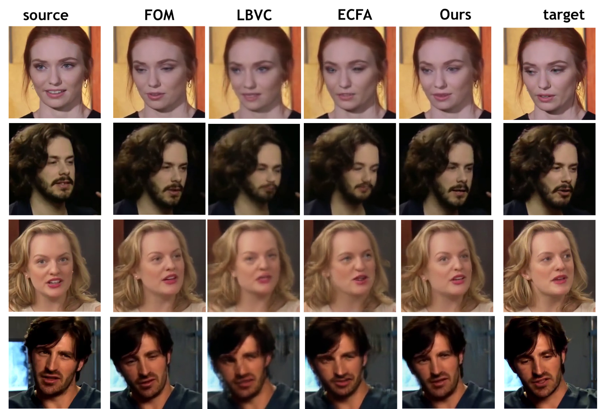
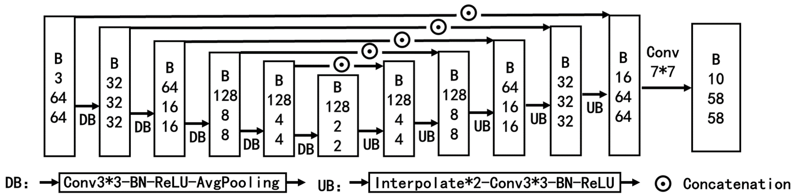
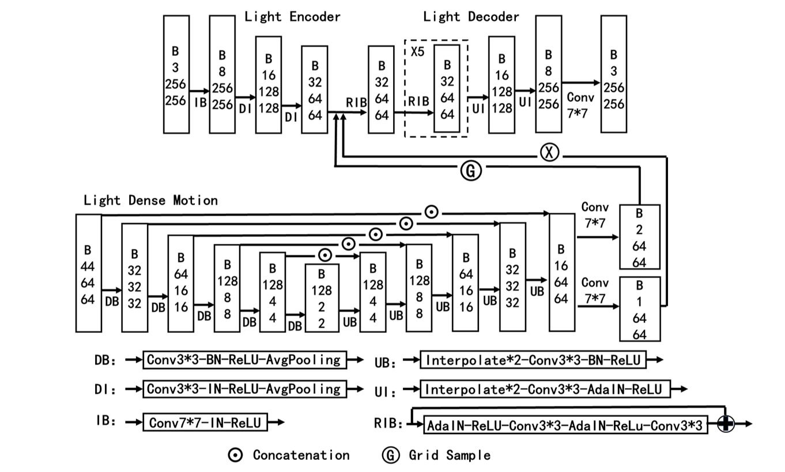
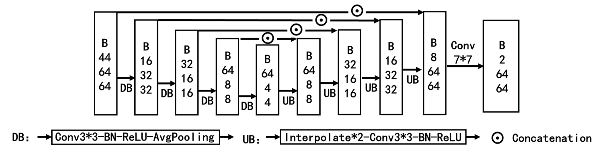

# SlimFit-Gens: Extremely-low Bandwidth One-on-one Portrait Video Calls on Mobile Devices
<html>
    <head>
        <link href="css/bootstrap-4.4.1.css" rel="stylesheet">
        <link href="https://fonts.googleapis.com/css?family=Open+Sans" rel="stylesheet" type="text/css">
                
    </head>

    <body>
        <!-- Video Show -->
         
        <section>
            

                

                    

                        <h2 style="font-size:30px;"> Qualitative comparisons on the Voxceleb dataset </h2>
                        

                         
                    

                

            
 
        </section>
        <section>
            

                

                    

                        <!-- <video width="100%" playsinline controls autoplay loop="loop" preload muted> -->
                            <!-- <source src="https://github.com/growthin2023/VIDAR.github.io/releases/download/v0.0/third_view.mp4" type="video/mp4"> -->
                        <!-- </video> -->
                        <!--  -->
                        <!--  -->
                        <!-- font-weight: bolder; -->
                        <h3 style="font-size:20px; color:black;">&nbsp;&nbsp;&nbsp;&nbsp;&nbsp;&nbsp;&nbsp;&nbsp;Origin&nbsp;&nbsp;&nbsp;&nbsp;&nbsp;&nbsp;&nbsp;&nbsp;&nbsp;&nbsp;&nbsp;&nbsp;&nbsp;&nbsp;&nbsp;FOM
                        &nbsp;&nbsp;&nbsp;&nbsp;&nbsp;&nbsp;&nbsp;&nbsp;&nbsp;&nbsp;&nbsp;&nbsp;&nbsp;&nbsp;&nbsp;&nbsp;&nbsp;LBVC
                        &nbsp;&nbsp;&nbsp;&nbsp;&nbsp;&nbsp;&nbsp;&nbsp;&nbsp;&nbsp;&nbsp;&nbsp;&nbsp;&nbsp;&nbsp;ECFA
                        &nbsp;&nbsp;&nbsp;&nbsp;&nbsp;&nbsp;&nbsp;&nbsp;&nbsp;&nbsp;&nbsp;&nbsp;&nbsp;&nbsp;&nbsp;Ours
                        &nbsp;&nbsp;&nbsp;&nbsp;&nbsp;&nbsp;&nbsp;H.264@10kbps</h3>
                        <video hight="100%" width="100%" playsinline controls autoplay loop="loop" preload muted>
                            <source src="https://github.com/anoymousauthor/anoymousauthor.github.io/releases/download/v1.0/out1.mp4" type="video/mp4">
                        </video>
                        <video hight="100%" width="100%" playsinline controls autoplay loop="loop" preload muted>
                            <source src="https://github.com/anoymousauthor/anoymousauthor.github.io/releases/download/v1.0/out2.mp4" type="video/mp4">
                        </video>
                        <video hight="100%" width="100%" playsinline controls autoplay loop="loop" preload muted>
                            <source src="https://github.com/anoymousauthor/anoymousauthor.github.io/releases/download/v1.0/out3.mp4" type="video/mp4">
                        </video>
                        <video hight="100%" width="100%" playsinline controls autoplay loop="loop" preload muted>
                            <source src="https://github.com/anoymousauthor/anoymousauthor.github.io/releases/download/v1.0/out4_1.mp4" type="video/mp4">
                        </video>
                    

                

            

        </section>
    
         
         

        <!-- Model Structure -->
         
        <section>
    		

    			

    				

    					<h3 style="font-size:30px;">Model Structure</h3>
    					

    					 
    				

    			

    		
 
    	</section>
    	<section>
    		

    			

                   

                        <h3 style="font-size:25px; ">KPD Network Structure:</h3>
                        <ol class="steps" width="50%" style="font-size:20px;">
                            <li class="active">KPD</li>
                            <li>PMG</li>
                            <li>AFG</li>
                        </ol>
                         
                    

    				

    					
    				

    			

    
    			

                   

                         
                        <h3 style="font-size:25px; ">PMG Network Structure:</h3>
                        <ol class="steps" width="50%" style="font-size:20px;">
                            <li class="done">KPD</li>
                            <li class="active">PMG</li>
                            <li>AFG</li>
                        </ol>
                         
                    

    				

    					
    				

    			

        
    			

                    

                         
                        <h3 style="font-size:25px; ">AFG Network Structure:</h3>
                        <ol class="steps" width="50%" style="font-size:20px;">
                            <li class="done">KPD</li>
                            <li class="done">PMG</li>
                            <li class="active">AFG</li>
                        </ol>
                         
                    

    				

    					
    				

                     
                    

    			

    		

    	</section>
    
    </body>

</html>
